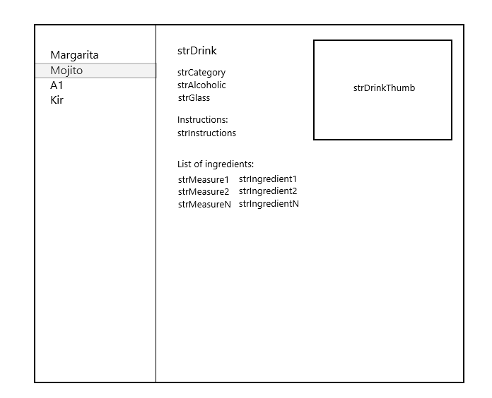
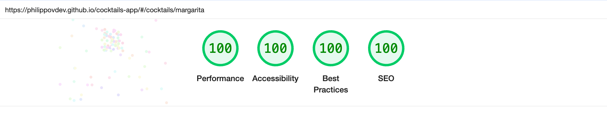

# Project Guidelines for Cocktails App



## Project Overview
This is a Vue 3 application for displaying cocktail information fetched from TheCocktailDB API. The application follows a domain-driven design architecture with clear separation of concerns.

---

## [LIVE DEMO](https://philippovdev.github.io/cocktails-app/)

---

## _Lighthouse Desktop_



### Key Features
- Cocktail data fetching from TheCocktailDB API
- State management using Pinia
- Routing with Vue Router
- Responsive design (360px to 1024px)
- Error handling
- Lazy loading for images

### Cocktails Used
- margarita
- mojito
- a1
- kir

## Project Structure
```
src/
├── application/
│   ├── FeatureName/ # domain
│   │   ├── domain/ # domain logic
│   │   │   ├── featureName.service.ts # API communication
│   │   │   └── featureName.controller.ts # business logic
│   │   ├── infrastructure/
│   │   │   ├── featureName.store.ts # Pinia store
│   │   │   └── featureName.router.ts # routing
│   │   └── presentation/ # UI components
│   │       ├── components/ # feature-specific components
│   │       └── views/ # feature views
├── assets/ # static assets
├── shared/ # shared utilities
├── libs/ # external services
├── App.vue
└── main.ts
```

## Functional Requirements
- Draft interface implementation
- Data fetching from API
- API reference: `GET: https://www.thecocktaildb.com/api/json/v1/1/search.php?s=<cocktail_code>`
- Cocktail codes used for router slugs and menu items
- Every menu item leads to related page with description
- Active menu item is highlighted
- By default, the first menu item is active and used for the main page
- Root site directory '/' redirects user to first menu item
- Non-existing pages redirect to 404 page
- Responsive interface with max width of 1024px and min width of 360px
- Adaptive interface for Chrome and Safari
- Lazy loading for images

## Non-Functional Requirements
- Scalable architecture that is easily extendable and modifiable
- Quality gates with instruments to guarantee code quality

## Quality Gates
This project implements several quality gates to ensure code quality:

### Type Checking
- TypeScript is used throughout the project
- Type checking is enforced during development and build process
- Run type checking: `pnpm type-check`

### Linting
- ESLint is configured with multiple plugins for Vue, TypeScript, and more
- Linting rules enforce code quality standards
- Run linting with auto-fix: `pnpm lint`

### Formatting
- Prettier is used for consistent code formatting
- Format the codebase: `pnpm format`

### Unit Testing
- Vitest is used for unit testing
- Tests ensure functionality works as expected
- Run unit tests: `pnpm test:unit`

### Pre-commit Hooks
- Husky is used to manage Git hooks
- Pre-commit hook runs linting to ensure code quality before commits
- Lint-staged ensures only staged files are linted

## Testing Guidelines
- Unit tests should be run using Vitest: `pnpm test:unit`
- When implementing solutions, ensure all tests pass before submitting

## Build Process
- Development server: `pnpm dev`
- Production build: `pnpm build`
- Type checking is enforced during the build process

## Code Style Guidelines
- TypeScript is used throughout the project
- Follow ESLint and Prettier configurations
- Run linting before submitting: `pnpm lint`
- Maintain the domain-driven architecture pattern
- Keep components focused on a single responsibility

## API Integration
- Use the TheCocktailDB API: `https://www.thecocktaildb.com/api/json/v1/1/search.php?s=<cocktail_code>`
- Handle API errors gracefully
- Implement proper loading states

## Project Setup

```sh
pnpm install
```

### Compile and Hot-Reload for Development

```sh
pnpm dev
```

### Type-Check, Compile and Minify for Production

```sh
pnpm build
```

### Run Unit Tests with [Vitest](https://vitest.dev/)

```sh
pnpm test:unit
```

### Lint with [ESLint](https://eslint.org/)

```sh
pnpm lint
```
